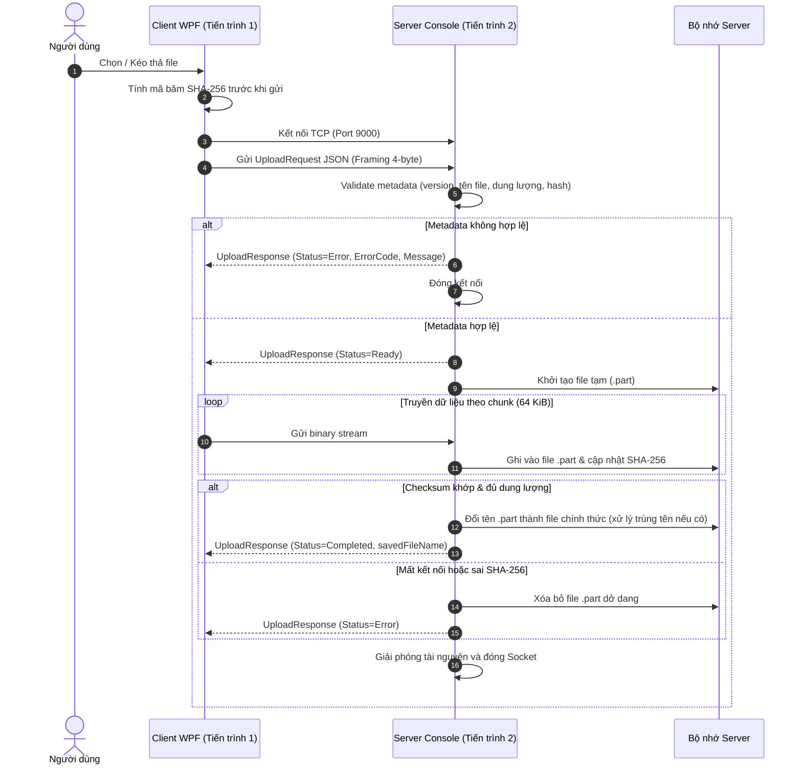

# UDM_10 — Ứng dụng upload nhiều file qua mạng

Đồ án môn **Lập trình mạng** của **Nhóm 11**. Sản phẩm là ứng dụng desktop **C# 100%** (.NET 10, WPF), kiến trúc **Client–Server**, cho phép chọn hoặc kéo thả nhiều file và truyền đồng thời tới TCP Server qua socket mạng thật.

Client và Server chạy **hai tiến trình độc lập**, giao tiếp qua **socket TCP thật**. Ứng dụng **không phải Web App**, **không dùng hàm nội bộ để mô phỏng Client–Server**, và tuân thủ toàn bộ quy định nộp bài của môn học.

| Nội dung | Thông tin |
| --- | --- |
| **Mã đề tài** | `UDM_10` |
| **Tên đề tài** | Ứng dụng upload nhiều file qua mạng |
| **Nhóm thực hiện** | Nhóm 11 |
| **Nền tảng / Ngôn ngữ** | C# 100% (.NET 10, WPF Desktop App — không phải Web App) |
| **Kiến trúc mạng** | Client–Server (2 tiến trình riêng biệt giao tiếp qua Socket TCP) |
| **Giao thức vận chuyển** | TCP |
| **Port mặc định** | `9000` (cấu hình linh hoạt qua file config hoặc giao diện GUI, không hard-code) |
| **GitHub Repository** | [https://github.com/lmn2005/UDM10_UploadFiles](https://github.com/lmn2005/UDM10_UploadFiles) |
| **Video Báo cáo / Demo** | [https://youtu.be/lFGhi14CTBE](https://youtu.be/lFGhi14CTBE) |
| **Quy cách file nộp** | `CourseCode-GroupCode-ProjectCode.7z` (ví dụ: `012012301304-Net3_Group_11-UDM_10.7z`) |

---

## 1. Thành viên và phân công công việc cụ thể

Nhóm gồm 5 thành viên. Mỗi thành viên commit bằng tài khoản GitHub cá nhân với commit message rõ ràng (không chỉ dùng `update`, `fix` hay `final`). Trong video báo cáo, mỗi thành viên trực tiếp trình bày phần việc của mình và **hiển thị khuôn mặt** để làm minh chứng đánh giá.

| MSSV | Họ và tên | Công việc cụ thể trong dự án |
| --- | --- | --- |
| **095205005482** | Lê Văn Nhựt | Thiết kế và lập trình giao diện C# WPF; xử lý chọn/kéo-thả nhiều file; hiển thị trạng thái kết nối & tiến độ; điều phối demo GUI, biên soạn báo cáo Word, slide thuyết trình và dựng video demo |
| **075205019210** | Phạm Anh Tuấn | Thiết kế C# Shared protocol; xây dựng framing độ dài 4 byte và serialization JSON; validator kiểm tra metadata, kích thước, định dạng và bảo mật đường dẫn; tài liệu kỹ thuật protocol |
| **087205010642** | Nguyễn Tấn Hiệp | Lập trình C# Client TCP Socket; xây dựng hàng đợi upload đa luồng (tối đa 3 file đồng thời / client); xử lý chức năng Hủy (Cancel) và Thử lại (Retry); tích hợp hệ thống và kiểm thử kết nối |
| **051206006174** | Huỳnh Anh Kiệt | Xây dựng C# TCP Server socket đa tiến trình/session; quản lý vòng đời kết nối, cơ chế timeout tự động, graceful shutdown; triển khai hệ thống logging máy chủ an toàn không chứa secret |
| **045205006605** | Võ Nhật Linh | Lập trình truyền nhận chunk stream; cơ chế lưu tạm file `.part` và xác thực SHA-256 toàn vẹn dữ liệu; thuật toán giải quyết trùng tên file; tính toán thống kê (tốc độ, thời gian) và thực hiện stress/performance test |

- **Bảng phân công chi tiết 5 tuần:** [`DOCX/Bang_phan_cong_thanh_vien_5_tuan.pdf`](DOCX/Bang_phan_cong_thanh_vien_5_tuan.pdf)
- **Báo cáo tóm tắt Word (≤ 15 trang, đúng mẫu):** [`DOCX/Baocao_Nhom11_UDM10.docx`](DOCX/Baocao_Nhom11_UDM10.docx)

---

## 2. Mục tiêu, phạm vi và công bố giới hạn sản phẩm

### 2.1. Các chức năng bắt buộc đã hoàn thành

1. **Giao diện Client (WPF):**
   - Hỗ trợ chọn một hoặc nhiều file qua hộp thoại hoặc kéo thả trực tiếp vào cửa sổ ứng dụng.
   - Quản lý hàng đợi tải lên thông minh, thực thi tối đa **3 file đồng thời** trên mỗi Client.
   - GUI hiển thị trực quan và cập nhật liên tục: trạng thái kết nối, trạng thái từng file (Chờ, Đang xử lý, Thành công, Thất bại, Đã hủy), thanh tiến độ %, tốc độ truyền tải (MB/s).
   - Tác vụ mạng dài được thực thi bất đồng bộ (`async/await`, `Task`), đảm bảo giao diện luôn mượt mà, **không bị đơ/treo**.
   - Hỗ trợ nút thao tác Hủy (Cancel) hoặc Thử lại (Retry) cho từng file riêng biệt, hoặc Hủy tất cả / Thử lại tất cả. Lỗi xảy ra ở một file không làm gián đoạn hay dừng các file khác.

2. **Giao tiếp mạng và xử lý Server (TCP):**
   - Client và Server chạy ở **hai tiến trình độc lập**, kết nối qua socket mạng TCP thật.
   - Server kiểm tra chặt chẽ metadata trước khi cho phép truyền dữ liệu; trả về mã lỗi (`ErrorCode`) và thông báo rõ ràng khi dữ liệu không hợp lệ.
   - Dữ liệu đang nhận được ghi vào file tạm `.part`; Server tính mã băm SHA-256 đồng thời khi nhận stream và chỉ đổi tên sang file chính thức khi nhận đủ byte và checksum khớp 100%. Dữ liệu chưa truyền xong **tuyệt đối không được công nhận là file hoàn chỉnh**.
   - Cơ chế tự động giải quyết trùng tên file: thêm hậu tố `_1`, `_2`, ... không bao giờ ghi đè file có sẵn trên máy chủ.
   - Quản lý tài nguyên an toàn: áp dụng khối `using` và `try-finally` để đóng Socket, giải phóng FileStream/NetworkStream khi kết thúc hoặc xảy ra sự cố.
   - Cơ chế ngắt kết nối an toàn: một Client gặp sự cố hoặc ngắt kết nối đột ngột được cách ly, không ảnh hưởng đến Server và các Client khác.
   - Server ghi nhật ký (log) đầy đủ các sự kiện quan trọng: mốc thời gian, IP kết nối/ngắt kết nối, lỗi, tên file, dung lượng, kết quả kiểm tra hash.

### 2.2. Giới hạn sản phẩm và các nội dung ngoài phạm vi thực hiện

Theo quy định đề tài, nhóm công bố rõ các giới hạn kỹ thuật của phiên bản hiện tại:
- **Không hỗ trợ Resume giữa chừng:** Khi mạng đứt hoặc hủy, file `.part` chưa hoàn thành sẽ bị xóa dọn dẹp; lần thử lại (Retry) sẽ bắt đầu tải lại từ đầu (không hỗ trợ pause/resume offset).
- **Không hỗ trợ tải cả thư mục:** Chỉ nhận danh sách file đơn lẻ, không hỗ trợ quét đệ quy cây thư mục.
- **Không có xác thực người dùng / mã hóa TLS:** Ứng dụng tập trung vào kỹ thuật socket TCP thuần túy, chưa tích hợp hệ thống tài khoản người dùng, chứng chỉ TLS/SSL hay lưu trữ đám mây.
- **Không điều khiển hoặc truy cập máy từ xa:** Đề tài chỉ thực hiện truyền file đơn chiều từ Client lên Server, do đó yêu cầu xin phép người dùng tại máy đích không phát sinh.
- **Chưa có cơ chế dọn `.part` mồ côi khi khởi động:** Nếu Server bị tắt cưỡng bức bằng Task Manager hoặc mất điện đột ngột trong lúc đang nhận file, các file `.part` dở dang trước đó chưa được tự động quét xóa khi Server bật lại.
- **Giới hạn đồng thời:** Giới hạn 3 file đồng thời được quản lý ở phía Client; Server xử lý đồng thời theo từng luồng/kết nối TCP độc lập và chưa đặt trần giới hạn tổng kết nối toàn hệ thống.

---

## 3. Kiến trúc hệ thống và giao tiếp mạng

### 3.1. Mô hình kiến trúc

Hệ thống được thiết kế theo mô hình **Client–Server** phân tán:

```text
[ Client WPF — Tiến trình 1 ]                          [ Server Console — Tiến trình 2 ]
┌──────────────────────────────────────────┐          ┌──────────────────────────────────────────┐
│ Giao diện người dùng (MainWindow / MVVM) │          │ TcpListener (Lắng nghe cổng 9000)        │
│    │                                     │          │    │                                     │
│    ▼                                     │          │    ▼                                     │
│ UploadManager / UploadQueueService       │          │ ClientConnectionHandler                  │
│    (Điều phối hàng đợi, tối đa 3 file)   │          │    (Xử lý phiên kết nối cho từng file)   │
│    │                                     │          │    │                                     │
│    ▼                                     │          │    ├── MetadataValidator (Kiểm tra tin)  │
│ UploadClientService                      │          │    ├── TemporaryFileManager (.part)      │
│    (Mở kết nối TCP độc lập cho mỗi file) │          │    ├── FileStorageService (Lưu file)     │
└──────────────────────────────────────────┘          │    ├── DuplicateFileNameResolver (_1,_2) │
                     │                                │    └── ServerLogger (Ghi nhật ký)        │
                     │ Socket TCP thật                └──────────────────────────────────────────┘
                     │ (Framing 4-byte + JSON + Stream)                    │
                     └─────────────────────────────────────────────────────┘
                                                      Thư viện dùng chung: Code/Shared
                                                      (Protocol, DTOs, Framing, Validators)
```

Chi tiết tài liệu protocol xem thêm tại: [`Code/README.md`](Code/README.md).

### 3.2. Cấu trúc Message và Giao thức ứng dụng (Protocol V3)

Mọi gói tin trao đổi mở đầu bằng cơ chế **Length-prefix Framing**:
```text
┌──────────────────────────────────────┬───────────────────────────────────────────┐
│   4 byte (Little-Endian Integer)     │       N byte Payload JSON (UTF-8)         │
│   Chỉ định độ dài payload JSON        │       Kích thước tối đa: 4096 byte        │
└──────────────────────────────────────┴───────────────────────────────────────────┘
```

Sau khi Server xác thực metadata hợp lệ và phản hồi `Ready`, Client sẽ chuyển sang truyền dòng dữ liệu nhị phân thô (**Raw Binary Stream**) đúng bằng `fileSize` byte qua cùng socket đó.

#### Cấu trúc UploadRequest (Client ➔ Server):
```json
{
  "protocolVersion": "V3",
  "requestId": "550e8400-e29b-41d4-a716-446655440000",
  "fileName": "tailieu_baocao.pdf",
  "fileSize": 10485760,
  "fileHash": "e3b0c44298fc1c149afbf4c8996fb92427ae41e4649b934ca495991b7852b855",
  "status": 1
}
```

#### Cấu trúc UploadResponse (Server ➔ Client):
```json
{
  "protocolVersion": "V3",
  "requestId": "550e8400-e29b-41d4-a716-446655440000",
  "status": 2,
  "errorCode": "None",
  "errorMessage": null,
  "savedFileName": "tailieu_baocao.pdf"
}
```

#### Bảng mã trạng thái (UploadStatus):
| Status | Giá trị | Ý nghĩa |
| --- | :---: | --- |
| `Request` | 1 | Client gửi yêu cầu và thông tin metadata bắt đầu upload |
| `Ready` | 2 | Server chấp nhận metadata, sẵn sàng nhận stream nhị phân |
| `Completed` | 3 | Server đã nhận đủ số byte và xác thực SHA-256 thành công |
| `Error` | 4 | Đã xảy ra lỗi (kèm mã lỗi và thông báo chi tiết) |
| `Cancel` | 5 | Giá trị định nghĩa trong enum phục vụ mở rộng |
| `Retry` | 6 | Không truyền qua mạng; Client tạo session mới khi Retry |

### 3.3. Quy trình kết nối và truyền nhận file



---

## 4. Xử lý lỗi, tài nguyên và bảo mật

1. **Xử lý ngắt kết nối đột ngột:**
   - Khi Client bị tắt cưỡng bức, mất điện hoặc rút dây mạng, Server phát hiện qua ngoại lệ I/O (hoặc đọc 0 byte), lập tức xóa file tạm `.part` liên quan và giải phóng tài nguyên.
   - Việc một Client gặp lỗi hoặc ngắt kết nối không gây ảnh hưởng đến Server hay bất kỳ Client nào khác.
2. **Cơ chế Timeout linh hoạt:**
   - Ứng dụng cấu hình timeout chặt chẽ cho mọi tác vụ mạng để tránh treo vô hạn:
     - Thời gian kết nối Client: 5.000 ms (`ConnectTimeoutMs`)
     - Thời gian chờ nhận dữ liệu: 30.000 ms (`ReceiveTimeoutMs`)
     - Thời gian chờ gửi dữ liệu: 30.000 ms (`SendTimeoutMs`)
     - Thời gian gửi thông báo lỗi của Server: 3.000 ms (`ErrorSendTimeoutMs`)
3. **Giải phóng tài nguyên (Resource Cleanup):**
   - Toàn bộ kết nối mạng (`Socket`, `TcpClient`, `NetworkStream`) và luồng tệp tin (`FileStream`) đều được bao bọc trong khối `using` hoặc khối `finally`, cam kết không bị rò rỉ tài nguyên hệ thống kể cả khi xảy ra lỗi ngoài ý muốn.
4. **Đảm bảo tính toàn vẹn dữ liệu:**
   - File đang truyền chỉ mang đuôi `.part`. Chỉ khi nhận đủ chính xác từng byte và đối soát mã băm SHA-256 trùng khớp 100%, file mới được hoàn tất. Dữ liệu lỗi hoặc chưa truyền xong **không bao giờ được công nhận**.
5. **Bảo mật và an toàn dữ liệu:**
   - Mã nguồn không chứa bất kỳ mật khẩu, secret, token hay khóa riêng tư (private key) nào.
   - Khi chạy demo và kiểm thử, nhóm chỉ sử dụng các tệp tin giả lập an toàn.
   - Tên file gửi lên được kiểm tra chống tấn công vượt thư mục (Path Traversal — ví dụ: `../`, `..\\`).
6. **Hệ thống nhật ký (Logging):**
   - Server ghi log chi tiết mọi sự kiện: dấu thời gian, IP và port của Client, sự kiện kết nối/ngắt kết nối, kết quả thẩm định metadata, tiến trình lưu file, các ngoại lệ và lỗi mạng. Tuyệt đối không ghi thông tin nhạy cảm vào log.

---

## 5. Yêu cầu môi trường và Cấu hình

### 5.1. Yêu cầu môi trường

- **Hệ điều hành:** Windows 10/11 x64 hoặc Windows Virtual Machine (do Client sử dụng giao diện WPF của Windows Desktop).
- **Bộ công cụ phát triển:** [.NET 10.0 SDK](https://dotnet.microsoft.com/download) trở lên.
- **Công cụ quản lý mã nguồn:** Git.
- **IDE khuyến nghị:** Visual Studio 2022 / 2026 hoặc JetBrains Rider / VS Code (có cài C# Dev Kit).

### 5.2. Bảng tham số cấu hình

Hệ thống cho phép cấu hình linh hoạt các tham số mạng và upload qua file cấu hình JSON hoặc trực tiếp trên giao diện Client, **không hard-code cho một máy duy nhất**:

| Tham số | File Server (`Code/Server/appsettings.json`) | File Client (`Code/Client/appsettings.json`) | Mô tả ý nghĩa |
| --- | --- | --- | --- |
| `Network:ServerIp` | `0.0.0.0` (lắng nghe mọi card mạng) | `127.0.0.1` | Địa chỉ IP máy chủ (nhập IP LAN khi chạy 2 máy) |
| `Network:Port` | `9000` | `9000` | Cổng TCP kết nối |
| `Network:ConnectTimeoutMs` | — | `5000` | Thời gian chờ kết nối tối đa (ms) |
| `Network:ReceiveTimeoutMs` | `30000` | `30000` | Thời gian chờ nhận gói tin tối đa (ms) |
| `Network:SendTimeoutMs` | — | `30000` | Thời gian chờ gửi gói tin tối đa (ms) |
| `Network:ErrorSendTimeoutMs` | `3000` | — | Thời gian chờ gửi báo lỗi trước khi đóng socket |
| `Upload:ChunkSizeBytes` | `65536` (64 KiB) | `65536` (64 KiB) | Kích thước mỗi khối chunk truyền qua TCP |
| `Upload:MaxConcurrentFiles` | — | `3` | Số file tối đa tải lên đồng thời trên mỗi Client |
| `Upload:MaxAllowedSizeInBytes` | `10737418240` (10 GiB) | — | Dung lượng tối đa cho phép của một file |
| `Upload:SaveDirectory` | `Uploads` | — | Thư mục lưu trữ file hoàn tất trên Server |

---

## 6. Hướng dẫn chạy và Demo

### 6.1. Hướng dẫn chạy nhanh trên cùng một máy (2 tiến trình riêng biệt)

Mở PowerShell tại **thư mục gốc repository**:

```powershell
# Bước 1: Khôi phục và biên dịch toàn bộ Solution
dotnet restore .\Code\UDM10.sln
dotnet build .\Code\UDM10.sln -c Release --no-restore

# Bước 2: Chạy Server (Cửa sổ dòng lệnh 1)
dotnet run --project .\Code\Server\UDM10.Server.csproj -c Release

# Bước 3: Chạy Client (Cửa sổ dòng lệnh 2)
dotnet run --project .\Code\Client\UDM10.Client.csproj -c Release
```

### 6.2. Hướng dẫn chạy giữa hai máy hoặc máy ảo qua mạng LAN

1. **Trên máy Server:**
   - Mở PowerShell và kiểm tra địa chỉ IPv4 bằng lệnh `ipconfig` (ví dụ: `192.168.1.50`).
   - Mở quyền tường lửa cho cổng 9000 (Inbound TCP rule) nếu cần:
     ```powershell
     New-NetFirewallRule -DisplayName "UDM10 Server TCP 9000" -Direction Inbound -LocalPort 9000 -Protocol TCP -Action Allow
     ```
   - Khởi động Server: `dotnet run --project .\Code\Server\UDM10.Server.csproj -c Release`
2. **Trên máy Client:**
   - Khởi động Client WPF: `dotnet run --project .\Code\Client\UDM10.Client.csproj -c Release`
   - Tại thanh cấu hình trên giao diện, đổi địa chỉ IP từ `127.0.0.1` thành IP máy Server (ví dụ: `192.168.1.50`), giữ Port `9000`.
   - Chọn hoặc kéo thả các file để bắt đầu quá trình tải lên qua mạng thật.

---

## 7. Kiểm thử hệ thống

Tập tin kịch bản kiểm thử chi tiết: [`Extra/Test_Case_LTM_Project_5_Tuan.xlsx`](Extra/Test_Case_LTM_Project_5_Tuan.xlsx).

| Nhóm kiểm thử | Các kịch bản thực hiện | Kết quả ghi nhận |
| --- | --- | --- |
| **1. Functional Test** | - Chọn 1 file, 3 file, 5 file, 20 file qua nút bấm hoặc kéo thả.<br>- Kiểm tra hàng đợi tối đa 3 file đồng thời.<br>- Cập nhật thanh tiến độ % và tốc độ MB/s mượt mà.<br>- Upload file trùng tên: Server tự đổi tên `ten_1.ext`, không ghi đè.<br>- Thao tác Hủy (Cancel) và Thử lại (Retry) từng file hoặc toàn bộ. | **ĐẠT (PASS)**: Toàn bộ chức năng giao diện và logic hàng đợi vận hành chính xác. |
| **2. Invalid Data Test** | - Metadata thiếu trường hoặc sai định dạng JSON.<br>- FileSize âm hoặc vượt quá 10 GiB.<br>- Đường dẫn chứa ký tự điều hướng thư mục trái phép (`../../etc`).<br>- Giả lập dữ liệu nhị phân bị hỏng dẫn đến sai SHA-256. | **ĐẠT (PASS)**: Server từ chối ngay lập tức, trả mã lỗi rõ ràng, xóa sạch file `.part`. |
| **3. Disconnect Test** | - Đóng tiến trình Client đột ngột trong khi file đang tải 50%.<br>- Dừng Server giữa chừng khi Client đang gửi.<br>- Rút mạng/ngắt kết nối bất ngờ. | **ĐẠT (PASS)**: Không treo tiến trình còn lại; file dở dang không được công nhận; kết nối khác không ảnh hưởng. |
| **4. Stress & Performance** | **Mức tải 1:** File 32 MiB, chunk 64 KiB.<br>**Mức tải 2:** File 512 MiB, chunk 256 KiB.<br>Đo trên TCP loopback với 2 tiến trình độc lập. | **Mức 1:** Throughput ~868,24 MB/s, Lỗi 0%.<br>**Mức 2:** Throughput ~1.495,09 MB/s, Lỗi 0%. |

---

## 8. Video Demo và Báo cáo

- **Link video báo cáo & demo:** [https://youtu.be/lFGhi14CTBE](https://youtu.be/lFGhi14CTBE) *(chế độ Unlisted/Public)*
- **Nội dung thể hiện trong video:**
  - Chứng minh rõ Client và Server là **hai tiến trình độc lập** giao tiếp qua mạng TCP socket.
  - Trình bày toàn bộ chức năng cốt lõi: chọn file, kéo thả, hàng đợi đa file, tiến độ %, tốc độ, giải quyết trùng tên.
  - Thực nghiệm kịch bản lỗi: truyền file không hợp lệ và **kịch bản ngắt kết nối đột ngột** giữa chừng.
  - Toàn bộ 5 thành viên nhóm trực tiếp thuyết minh phần việc của mình và **hiển thị khuôn mặt minh chứng**.

---

## 9. Cấu trúc Repository

Cấu trúc cây thư mục tuân thủ tuyệt đối chuẩn yêu cầu của môn học:

```text
UDM10_UploadFiles/
├── Code/                          # Toàn bộ mã nguồn dự án (.NET 10)
│   ├── Client/                    # Ứng dụng Desktop Client (WPF)
│   ├── Server/                    # Ứng dụng TCP Server (Console)
│   ├── Shared/                    # Thư viện dùng chung (Protocol, DTOs, Framing, Validation)
│   ├── Directory.Build.props      # Cấu hình biên dịch .NET chung
│   ├── UDM10.sln                  # Visual Studio Solution chứa toàn bộ projects
│   └── README.md                  # Hướng dẫn kỹ thuật chi tiết về mã nguồn và protocol
├── DOCX/                          # Thư mục chứa báo cáo và tài liệu phân công
│   ├── Baocao_Nhom11_UDM10.docx   # Báo cáo tóm tắt Word (tối đa 15 trang, đúng chuẩn)
│   └── Bang_phan_cong_thanh_vien_5_tuan.pdf  # Bảng phân công chi tiết 5 tuần
├── Extra/                         # Thư mục tài liệu bổ trợ và bằng chứng kiểm thử
│   └── Test_Case_LTM_Project_5_Tuan.xlsx     # Bảng kịch bản kiểm thử chi tiết 5 tuần
├── PPTX/                          # Thư mục lưu trữ file thuyết trình PowerPoint
│   └── .gitkeep                   # (Nhóm đặt file .pptx vào đây khi có yêu cầu thuyết trình)
├── .gitignore                     # Cấu hình loại bỏ build/cache/tài nguyên tạm
└── README.md                      # Tài liệu tổng quan đồ án và hướng dẫn chạy
```

---

## 10. Danh mục hồ sơ nộp bài trên Course

Nhóm kiểm tra kỹ lưỡng và đối chiếu danh mục nộp bài trước thời hạn đóng hệ thống:

| STT | Thành phần hồ sơ | Trạng thái | Ghi chú vị trí |
| :---: | --- | :---: | --- |
| 1 | **Mã nguồn đầy đủ (Source Code)** | Đã sẵn sàng | Nằm trong thư mục `Code/` (đã dọn dẹp sạch sẽ `bin/`, `obj/`, cache) |
| 2 | **Danh sách phân công công việc cụ thể** | Đã sẵn sàng | Có chi tiết trong `README.md` và file `DOCX/Bang_phan_cong_thanh_vien_5_tuan.pdf` |
| 3 | **Báo cáo tóm tắt Word (.docx)** | Đã sẵn sàng | Đặt tại `DOCX/Baocao_Nhom11_UDM10.docx` (≤ 15 trang, đúng mẫu) |
| 4 | **Tập tin PowerPoint (.pptx)** | Thư mục sẵn sàng | Thư mục `PPTX/` đã sẵn sàng đón nhận file `.pptx` khi có lịch thuyết trình |
| 5 | **Link GitHub Repository** | Đã sẵn sàng | [https://github.com/lmn2005/UDM10_UploadFiles](https://github.com/lmn2005/UDM10_UploadFiles) |
| 6 | **Link video báo cáo & demo** | Đã sẵn sàng | [https://youtu.be/lFGhi14CTBE](https://youtu.be/lFGhi14CTBE) (đã tích hợp trong README và Báo cáo) |
| 7 | **Đóng gói file nộp** | Hướng dẫn sẵn sàng | Tên file: `CourseCode-GroupCode-ProjectCode.7z` |

> **Lưu ý quan trọng khi đóng gói `.7z` nộp bài:**
> - Kiểm tra và xóa toàn bộ các thư mục sinh tự động: `bin/`, `obj/`, `.vs/`, thư mục lưu trữ `Uploads/`, các file `.part`, file log tạm.
> - **Tuyệt đối không** đóng gói thư mục `.git` vào file `.7z`.
> - Thực hiện giải nén thử nghiệm file `.7z` trên máy tính khác và chạy kiểm tra trước khi nộp chính thức lên hệ thống Course.
